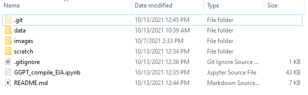

# US EIA Data Workflow

Retrieving and Compiling Data from the United States Energy Information Administration

October 4, 2021

## Description

For gas plant data in the United States we rely entirely on the US Energy Information Administration's datasets. There are two downloads that need to be joined. Freqent updates are made to generator data (EIA-860M), but annually there is a release of the generator data (EIA-860) including ownership info and other details.

## Getting Started: Data

### Data
***Form EIA-860 detailed data with previous form data (EIA-860A/860B)***

[Form EIA-860](https://www.eia.gov/electricity/data/eia860/) has city, CHP, dual-fuel, and ownership data.

***Preliminary Monthly Electric Generator Inventory (based on Form EIA-860M as a supplement to Form EIA-860)***

[Form EIA-860M](https://www.eia.gov/electricity/data/eia860m/) has generator (unit) data.

### Metadata
Form EIA-860 (see Data section above) downloads a zipped folder, and within that there are two helpful items: a PDF of instructions and an Excel Spreadsheet called “Layout”.

The "Layout" file contains reference tables for abbreviations and column definitions.

The “Instructions” PDF in this download has code definitions as well, same as in Layout. In 2020 it was in Table 28 “Energy Source Codes and Heat Content”:

Here are some helpful tables:

### Dependencies

Be aware that you may need to install some software or libraries to run this code, so if you immediately hit errors, check that first. The “import” statements at the beginning of each file let you know what libraries you need installed. You may also need to download Python, and authorize Pygsheets.

### Installing
There's great instructions at [Cloning a repository](https://docs.github.com/en/github/creating-cloning-and-archiving-repositories/cloning-a-repository)
* To use this code you can manually download it from this Github site as a zipped folder
* You can also use Git in your own code editor or command line: `git clone https://github.com/GlobalEnergyMonitor/GGPT-US-EIA.git` in the local folder one step above where you want to save the files 

### Pygsheets
To programmatically access a Google sheet this code utilizes [Pygsheets](https://pygsheets.readthedocs.io/en/stable/). You will need to do an initial installation and authorize your code in Google Console following the steps at [Authorization](https://pygsheets.readthedocs.io/en/stable/authorization.html).

After you authorize your code, you need a config.py file in your root directory for this project with your authorization details, which were saved for you. This file is a *secret* so it doesn't get added to the repo. You have to create it.

Here is a look at the folder structure on my local machine. Many of these files are *ignored* by Git (only saved locally, not in the shared repo), which is documented in the .gitignore file. Notice **config.py** and **sheets.googleapis.com-python.json** - both are only saved on my local machine, not in the repo.

### Steps Overview

1. Manually download files from EIA websites linked above under "Data"
2. Run Jupyter notebook
3. Manually edit GGPT based on the output

### Folder Structure and Example Filename Outputs
* Your Local Folder --> install repo here 
    * scratch
        * eiaComparedShared_10 07 2021 11-58-43.xlsx
        * ggptMissingFromEIA_10 07 2021 11-58-43.xlsx
        * eiaMissingFromGGPT_10 07 2021 11-58-43.xlsx

## Detailed Workflow

**Step 2:**
### Read and Process EIA Data

Compile EIA data including joining 860 and 860M datasets.
    
 ### Compare EIA Data to GGPT

You could re-write this to compare EIA data to previous EIA data. I preferred to already have it formatted to match our domains and fields, and so found it as easy to compare to GGPT itself.

This step uses Pandas "compare" function for units that are in both EIA and GGPT (they share the same plant and generator ID from the EIA dataset). It prints out that file, and it also prints out a file for what fields are missing from the GGPT that are in the new EIA dataset, and in addition if any of the GGPT units are not in the new EIA (more of a QC step than anything).

**Step 3:**

### Manual GGPT Editing
Based on the outputs from the table comparison you'll need to manually go into the North America tab of the GGPT and make edits. All of the outputs are in the "scratch" folder.

## Help

Problems? Contact Sarah or Mason

## Authors

Sarah Clark 
@saclarky

## Version History

* 0.1
    * Initial Release

## License

TODO

## Acknowledgments

* [Pandas](https://pandas.pydata.org/docs/index.html)
* [Pygsheets](https://pygsheets.readthedocs.io/en/stable/index.html)